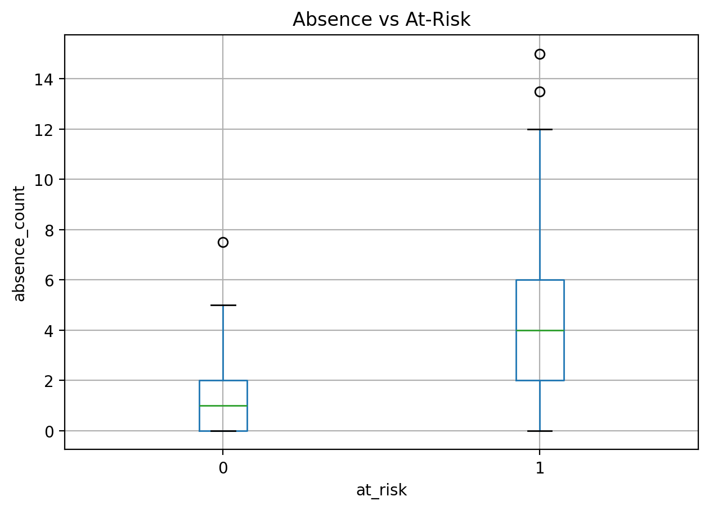
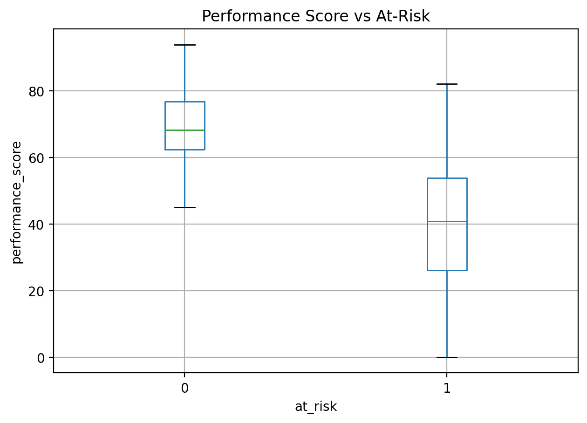
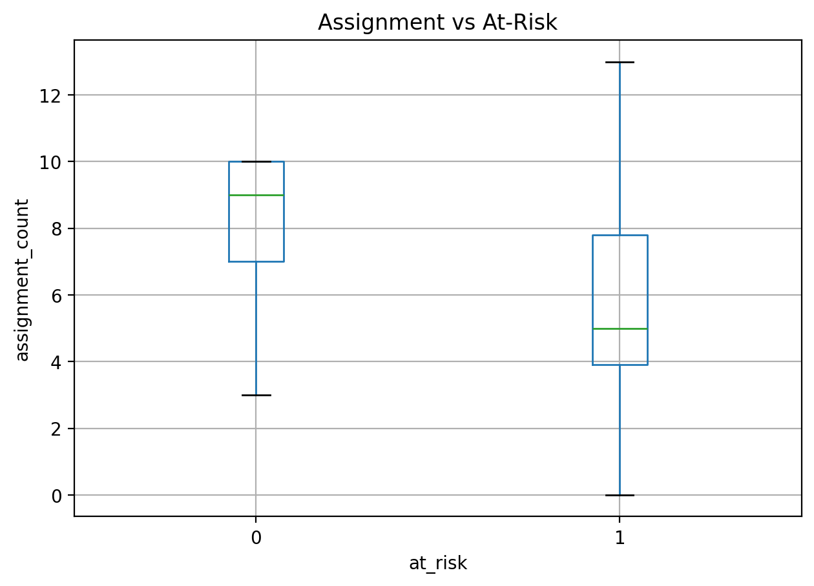
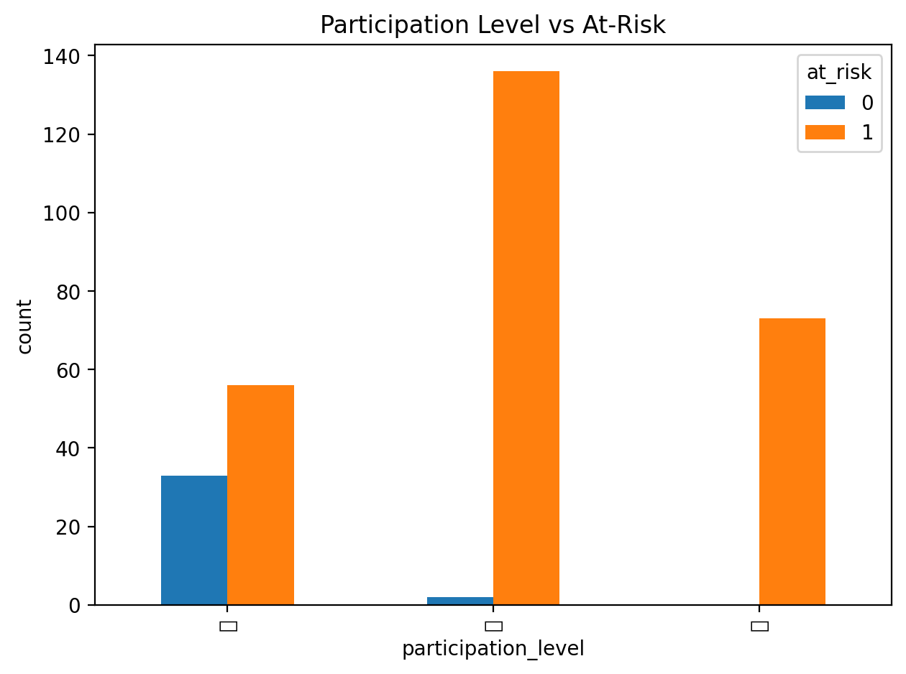
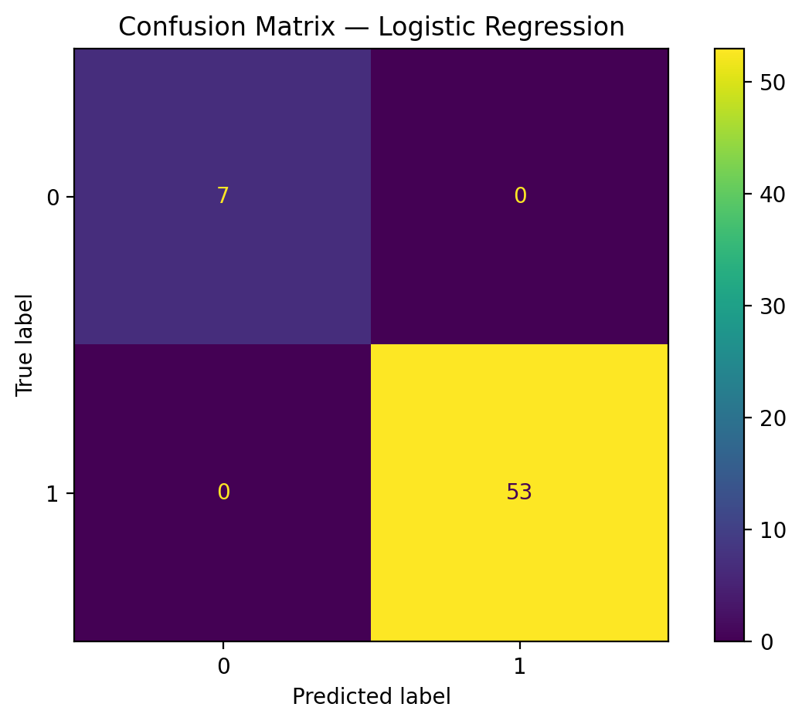
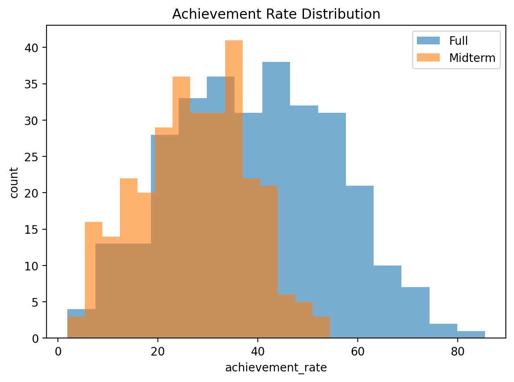
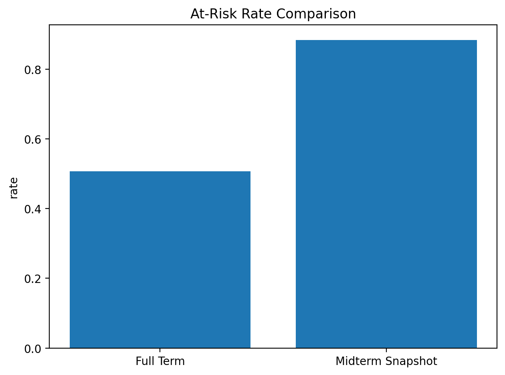

# 최성보 신호등 (MAP LIGHT) : EduTech Risk Prediction

학기 중간 시점의 학습/행동 데이터를 기반으로,  
최소성취수준 보장지도 대상(위험군)을 조기에 식별하고 교사 개입까지 제공하는 End-to-End AI 서비스입니다.

- 배포 서비스: https://maplight.onrender.com
- Render 무료 플랜으로 배포되어 첫 시작에 오랜 시간이 소요(cold-start)됩니다.

---

개발/운영/재현 가이드는 [`README_DEV.md`](README_DEV.md)를 참고해주세요.

---

## 1. 프로젝트 개요

2022 개정 교육과정에서는 최소성취수준 보장지도가 도입되었습니다. 다음 조건에 해당하는 학생은 보충지도를 의무적으로 실시해야 합니다.

- 성취율 40% 미만
- 결석률 1/3 이상(출석률 2/3 미도달)

문제는 학기 종료 후 성취율이 확정되기 때문에 학기 중간 시점에는 위험군 선별 기준이 부재하다는 점입니다.

해당 프로젝트는 교사가 예방지도를 위한 예비군을 선별해야 하는 현장 업무 부담을 데이터 기반으로 경감하는 것을 목표로, 다음과 같은 의문을 해결하기 위해 시작합니다.

- 학기 중간 데이터만으로 위험군을 조기에 찾을 수 있는가?
- 예측 결과를 점수만이 아니라 교사 행동까지 제시할 수 있는가?

---

## 2. 핵심 기능

- CSV 업로드 기반 위험 예측 (`POST /api/predict`)
- 학교/학급별 평가 정책 입력
- 위험 확률(`risk_proba`) + 위험 등급(`risk_level`) 제공
- 교사 개입 근거 컬럼 자동 생성
  - `top_reasons`
  - `score_guidance`
  - `action`
  - `remaining_absence_allowance`
- 대시보드 탐색 기능
  - 컬럼 정렬/필터/숨김
  - 스티키 헤더
  - 학생 상세 드로어
  - 모바일 플로팅 네비게이션
- 결과 CSV 다운로드 (`GET /api/download/{filename}`)

---

## 3. 기술 스택

### Backend / ML

### Frontend

### Infra / Deploy

---

## 4. 프로젝트 로드맵

- [x] 기획
- [x] 데이터 설계 및 더미 데이터 생성
- [x] EDA 및 전처리 방향 수립 (Notebook)
- [x] 모델 학습/검증 실험 (Notebook)
- [x] 실험 코드를 파이썬 모듈/스크립트로 전환
- [x] 개입전략 및 리포트 자동화 로직 추가
- [x] FastAPI 백엔드 구현
- [x] React 프론트엔드 구현
- [x] Docker/Render 배포
- [x] 이슈 분석/회고 문서화(`docs/`)

### 1단계: EDA와 전처리

초기에는 `notebook/01_eda.ipynb`, `notebook/02_risk_prediction.ipynb`에서  
중간 시점 데이터의 분포와 위험군 패턴을 확인했습니다.

핵심 확인 포인트:

- 결석 증가와 위험군 비율 관계
- 수행/중간 점수와 위험군 관계
- 과제/참여도와 위험군 관계
- 중간 시점 특성상 `final_score` 결측(all-NaN) 처리 필요성

결과 이미지:

- 결석과 위험군
  
- 수행평가와 위험군
  
- 과제 제출과 위험군
  
- 참여도와 위험군
  

전처리 구현 결과:

- `backend/src/preprocessing.py`로 파이프라인 모듈화
- 결측 플래그(`*_missing`)를 피처로 보존
- all-NaN 컬럼 fallback 처리
- 참여도 인코딩(`participation_level_num`)
- 라벨 생성 규칙(`at_risk`) 정리

### 2단계: 모델 실험과 선택

EDA 이후 위험군 분류 baseline으로 Logistic Regression을 먼저 확정했습니다.

#### 왜 Logistic Regression을 선택했는가

1. 해석 가능성

- 교육 현장에서는 "왜 위험한가"가 중요하므로 계수 기반 설명이 가능한 모델이 필요했습니다.

2. 데이터 구조 적합성

- 현재 데이터는 정형(tabular) + 제한된 피처 구조이므로, 초기 baseline으로 선형 모델이 적합했습니다.

3. 확률 기반 의사결정

- `predict_proba`를 활용해 학교별 정책에 따라 컷오프를 조정할 수 있습니다.

계수 산출물(`reports/tables/feature_importance_logistic.csv`) 예시:

- `absence_count`: +0.293
- `midterm_score`: -1.278
- `performance_score`: -1.289

### 3단계: 성능 평가 기준 설계

모델을 선택한 뒤, 지표를 "정확도 단일 기준"이 아니라 현장 개입 목적 기준으로 정했습니다.

> 해석 주의:
>
> - 저장소 데이터는 더미(시뮬레이션) 데이터입니다.
> - 단일 학습 지표(1.0)는 과대평가 가능성이 있으므로 CV/외부 검증 중심으로 해석합니다.
> - 본 프로젝트의 핵심 성과는 "운영 가능한 파이프라인 + 개입 가능한 리포트" 구축입니다.

#### 성능 평가 기준 선정

- Recall: 위험군 누락 최소화(개입 대상 놓치지 않기)
- Precision: 과개입/자원 낭비 방지
- F1: Recall-Precision 균형 확인
- Accuracy: 보조 지표

또한 단일 split 과대평가를 피하기 위해 5-Fold CV(교차 검증) 결과를 함께 사용했습니다.

#### 성능평가 결과:

| Metric    |       Mean |        Std |
| --------- | ---------: | ---------: |
| Accuracy  | **0.9900** | **0.0091** |
| Precision | **0.9963** | **0.0083** |
| Recall    | **0.9925** | **0.0103** |
| F1        | **0.9943** | **0.0052** |

위 지표는 `reports/tables/cv_metrics_logistic.csv` 기반 5-Fold CV 입니다.

시각화 참고(혼동행렬은 holdout 예측 결과, 나머지 그래프는 데이터 분포 확인용):

- 혼동 행렬
  

- 성취율 분포
  

- 위험군 비율 비교
  

결과 해석:

- 평균 Recall **0.9925**(Std **0.0103**)로 위험군 누락을 거의 만들지 않는 패턴을 보여, 본 프로젝트의 핵심 목표(개입 대상 선별)와 지표 선택 기준이 일치합니다.
- Precision **0.9963**도 함께 높아 과개입 가능성은 낮게 나타났고, Recall-Precision 균형 지표인 F1(**0.9943**) 역시 안정적입니다.
- Fold별 점수가 `0.983~1.000` 범위에 머물러 데이터 분할에 따른 성능 흔들림이 크지 않으며, 현재 더미 데이터 기준에서는 분류 경계가 일관되게 형성됩니다.
- 다만 holdout 혼동행렬(`[[7, 0], [0, 53]]`)과 일부 Fold의 완전 분류(1.000)는 실제 성능 보장이라기보다 더미 데이터의 높은 분리도 영향을 크게 받았을 가능성이 큽니다.
- 따라서 이 결과는 “모델 일반화 성능 확정”보다 “운영 가능한 위험군 예측 파이프라인/리포트 동작 검증”의 근거로 해석하고, 실제 데이터 적용 시 외부 검증, 임계값 재조정이 필요합니다.

#### 순열 중요도 결과:

Permutation Importance(`reports/tables/permutation_importance.csv`)

결과 해석:

- `absence_count`가 가장 큰 중요도(`importance_mean ≈ 0.0536`)를 보여, 결석 정보가 위험군 예측에 가장 크게 기여했습니다.
- 다음으로 `participation_level_num`(`≈ 0.0329`), `behavior_score`(`≈ 0.0223`), `midterm_score`(`≈ 0.0202`) 순으로 영향을 주며, 학습 참여/행동/중간 성취 신호가 핵심 변수로 작동했습니다.
- `night_study`, `question_count`는 보조적인 신호(약 `0.004`대)로 해석할 수 있고, `assignment_count` 영향은 매우 작았습니다.
- `midterm_score`, `final_score`, `performance_score` 및 결측 플래그 변수들(`*_missing`)는 결측이 가능하기에 이를 유의해서 읽어야 합니다.
- 순열 중요도는 상관된 변수들 사이에서 중요도가 나뉠 수 있으므로, 계수 해석(Logistic Regression)과 함께 보는 것을 기준으로 삼았습니다.

### 4단계: 파이썬 모듈화 + 개입전략/리포트 자동화

노트북 실험에서 끝내지 않고 서비스 운영 가능한 형태로 코드화했습니다.

- 모델 학습 스크립트: `backend/scripts/train_model.py`
- 배치 리포트 생성: `backend/scripts/generate_prediction_report.py`
- 리포트 로직 모듈: `backend/src/report_logic.py`

자동 생성 컬럼:

- `risk_proba`, `risk_level`
- `top_reasons`
- `score_guidance`
- `action`
- `absence_limit`, `remaining_absence_allowance`

즉, "위험 점수 출력"에서 끝나지 않고 "개입 가능한 문장/가이드 생성"까지 확장했습니다.

### 5~7단계: 백엔드, 프론트, 배포

#### 백엔드 (FastAPI)

- `backend/api/main.py`
- 업로드/예측/다운로드/샘플 API 구성
- 정책 입력(JSON) 기반 동적 계산

#### 프론트엔드 (React)

- `client/src/pages/LandingPage.tsx`
- `client/src/pages/DashboardPage.tsx`
- 업로드 -> 결과 확인 -> 상세 탐색 -> CSV 다운로드 UX

#### 배포

- Docker 멀티스테이지 빌드
- Render 단일 서비스 배포
- 서비스 URL: https://maplight.onrender.com

---

## 5. 프로젝트 프리뷰

웹 페이지 스크린샷 (PC / Mobile): [`screenshots.md`](docs/_README_screenshots.md)

---

## 6. 프로젝트 포인트

- 실험 노트북 -> 서비스 코드로 전환한 제품화 경험
- 모델 선택/평가 기준을 교육 개입 목적과 연결해 설명 가능
- 예측 결과를 교사 행동 전략까지 확장한 리포트 자동화
- 데이터/모델/API/UI/배포 전 과정을 경험

---

## 7. 프로젝트 한계 및 개선점

- 더미 데이터 기반 실험으로 실제 학교 데이터 일반화 검증의 필요하다.
  - 개인정보 및 교육청 데이터를 접근할 수 있는가의 고민이 필요하다.
- Logistic Regression 단일 모델 구조로 비선형 관계를 충분히 반영하지 못한다.
  - RandomForest / XGBBoost 등의 비교 실험 등을 추가할 필요성이 있다.
- 모델 설명은 전역 중요도 중심이며, LLM을 통해 개별 학생의 교사 피드백 요소를 추가해도 좋을 것 같다.
- 정책 기반 성취율 계산은 사용자 입력에 의존하며 자동 검증 기능이 제한적입니다.
  - 나이스 API(존재한다면), 전자교과서와의 연동 방향성도 좋은 것 같다.
- 단일 세션 기반 구조로 데이터 영속성(DB)이 존재하지 않는다.
  - 현재의 프로젝트에서는 DB의 필요성이 부족하지만 추후 규모가 커지게 된다면 필요할 것 같다.
  - 당장 새로고침시 초기화를 막으려면 쿠키나 캐시를 이용하는 것도 나쁘지 않아 보인다.
  - DB를 통해 히스토리 기능을 추가해 변화하는 과정을 제공하는 것도 좋아보인다.

---

## 8. 문서

문서 목록 보기 / 접기

 

| 분류        | 문서                                                                                                                                         | 설명                                                                 |
| ----------- | -------------------------------------------------------------------------------------------------------------------------------------------- | -------------------------------------------------------------------- |
| 개발 온보딩 | [`docs/_README_screenshots.md`](docs/_README_screenshots.md)                                                                                 | README용 화면 스크린샷(PC/Mobile) 정리                               |
| 개발 온보딩 | [`README_DEV.md`](README_DEV.md)                                                                                                             | 로컬 실행, 환경변수, 점검 체크리스트, Docker/배포, 재현 절차         |
| 개발        | [`docs/dev_API_SPEC.md`](docs/dev_API_SPEC.md)                                                                                               | 백엔드 API 엔드포인트, 요청/응답 형식, 에러 응답, `policy` 스펙 정리 |
| 개발        | [`docs/dev_PROJECT_STRUCTURE.md`](docs/dev_PROJECT_STRUCTURE.md)                                                                             | 프로젝트 디렉터리 구조, 계층 책임, 실행/배포 관점 파일 관계          |
| 이슈        | [`docs/issues_backend_frontend_guidance_design.md`](docs/issues_backend_frontend_guidance_design.md)                                         | 백엔드/프론트 연계 가이드 및 디자인 관련 이슈 정리                   |
| 이슈        | [`docs/issues_docker_desktop_ports_not_visible.md`](docs/issues_docker_desktop_ports_not_visible.md)                                         | Docker Desktop에서 포트 노출이 보이지 않는 문제 정리                 |
| 이슈        | [`docs/issues_dummy_dataset_generation.md`](docs/issues_dummy_dataset_generation.md)                                                         | 더미 데이터셋 생성 과정에서의 이슈와 해결 기록                       |
| 이슈        | [`docs/issues_filter_popover_scroll_and_positioning.md`](docs/issues_filter_popover_scroll_and_positioning.md)                               | 필터 팝오버 스크롤/위치 문제 해결 기록                               |
| 이슈        | [`docs/issues_table_sticky_and_horizontal_scroll.md`](docs/issues_table_sticky_and_horizontal_scroll.md)                                     | 테이블 sticky header / 가로 스크롤 관련 이슈 정리                    |
| 이슈        | [`docs/issues_technical_issues_and_resolutions.md`](docs/issues_technical_issues_and_resolutions.md)                                         | 개발 중 기술 이슈와 해결 내역 종합 정리                              |
| 이슈        | [`docs/issues_upload_not_navigate_to_dashboard_in_docker.md`](docs/issues_upload_not_navigate_to_dashboard_in_docker.md)                     | Docker 환경에서 업로드 후 대시보드 이동 실패 이슈 정리               |
| 학습        | [`docs/study_deployment_env_hardcoding_checklist.md`](docs/study_deployment_env_hardcoding_checklist.md)                                     | 배포 환경 하드코딩 점검 체크리스트 정리                              |
| 학습        | [`docs/study_docker_usage_and_dockerfile_guide.md`](docs/study_docker_usage_and_dockerfile_guide.md)                                         | Docker 사용법 및 Dockerfile 구성 가이드                              |
| 학습        | [`docs/study_FastAPI_File_Upload_Guide.md`](docs/study_FastAPI_File_Upload_Guide.md)                                                         | FastAPI 파일 업로드 처리 학습 문서                                   |
| 학습        | [`docs/study_FastAPI_structure_guide.md`](docs/study_FastAPI_structure_guide.md)                                                             | FastAPI 프로젝트 구조/분리 방식 학습 정리                            |
| 학습        | [`docs/study_frontend_backend_browser_access_local_vs_docker_guide.md`](docs/study_frontend_backend_browser_access_local_vs_docker_guide.md) | 로컬 vs Docker 환경에서 브라우저 접근 차이 정리                      |
| 학습        | [`docs/study_pandas_apply_mechanism.md`](docs/study_pandas_apply_mechanism.md)                                                               | pandas `apply` 동작 방식 학습 정리                                   |
| 학습        | [`docs/study_python_exception_guide.md`](docs/study_python_exception_guide.md)                                                               | Python 예외 처리 기본/패턴 정리                                      |
| 학습        | [`docs/study_python_functions.md`](docs/study_python_functions.md)                                                                           | Python 함수 개념/작성 패턴 학습 정리                                 |
| 학습        | [`docs/study_react_structure_guide.md`](docs/study_react_structure_guide.md)                                                                 | React 프로젝트 구조 설계 가이드 정리                                 |
| 학습        | [`docs/study_render_single_service_deployment_guide.md`](docs/study_render_single_service_deployment_guide.md)                               | Render 단일 서비스 배포 방식 학습 정리                               |
| 학습        | [`docs/study_requirements_txt_guide.md`](docs/study_requirements_txt_guide.md)                                                               | `requirements.txt` 관리/구성 가이드 정리                             |
| 학습        | [`docs/study_scss_color_functions.md`](docs/study_scss_color_functions.md)                                                                   | SCSS 색상 함수 사용법/패턴 정리                                      |

---
