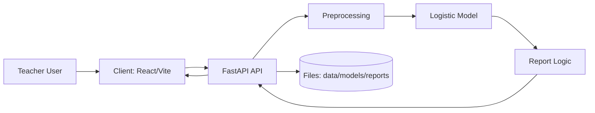

# 프로젝트 구조 (dev_PROJECT_STRUCTURE)

이 문서는 `edutech-risk-prediction` 저장소의 디렉터리 구조, 계층별 책임, 실행 흐름, 생성물 위치를 개발자 관점에서 정리한 문서입니다.

---

- 루트
  - 서비스 안내: [README.md](../README.md)
  - 개발/운영/재현 가이드: [README_DEV.md](../README_DEV.md)

---

## 1. 구조 개요

이 프로젝트는 다음 4개 축으로 구성됩니다.

- `backend/`: FastAPI API 서버 + 전처리/리포트 로직 + 학습/배치 스크립트
- `client/`: React + Vite 대시보드/업로드 UI
- `data/`, `models/`, `reports/`: 데이터/모델/산출물 저장 영역
- `docs/`: 개발 중 이슈/학습/운영 관련 문서

배포 시에는 단일 Docker 컨테이너에서:

- FastAPI가 API 제공
- FastAPI가 `client/dist` 정적 파일을 함께 서빙

하는 구조입니다.

---

## 2. 루트 디렉터리 트리 (핵심)

```text
edutech-risk-prediction/
├─ backend/                  # FastAPI + ML 전처리/리포트/스크립트
│  ├─ api/                   # API 라우트(현재 main.py 단일 진입)
│  ├─ src/                   # 도메인 로직(전처리, 설정, 리포트 확장)
│  └─ scripts/               # 학습/배치 리포트/스모크 테스트
├─ client/                   # React + Vite 프론트엔드
│  ├─ src/
│  │  ├─ pages/              # 페이지 단위 컴포넌트
│  │  ├─ components/         # 공통/업로드/대시보드 UI 컴포넌트
│  │  ├─ hooks/              # UI 동작용 커스텀 훅
│  │  ├─ shared/             # API 호출, 타입, 상수
│  │  └─ styles/             # SCSS 스타일
│  └─ public/                # 정적 에셋
├─ data/                     # 원본/가공/더미 데이터 저장소
│  ├─ raw/
│  ├─ processed/
│  └─ dummy/
├─ models/                   # 학습된 모델(joblib)
├─ reports/                  # 분석/평가/예측 결과 산출물
│  ├─ figures/
│  └─ tables/
├─ docs/                     # 개발 문서(이슈 해결/학습/가이드)
├─ notebook/                 # 실험용 노트북(탐색/분석)
├─ design/                   # 디자인 시안/리소스
├─ preview/                  # 미리보기/검토용 산출물
├─ requirements.txt          # Python 의존성
├─ package.json              # 루트 개발 스크립트(백+프론트 동시 실행)
├─ Dockerfile                # 단일 컨테이너 배포 정의
├─ README.md                 # 프로젝트 소개/성과 중심 문서
└─ README_DEV.md             # 개발/운영/재현 가이드
```

참고:

- `venv/`, `node_modules/`, `__pycache__/`는 로컬 개발 환경/캐시 폴더이며 구조 설명의 핵심 대상은 아닙니다.

---

## 3. 아키텍처 관점 구조

### 3.1 계층 구분



### 3.2 런타임 처리 흐름 (예측 요청 기준)

1. 교사는 CSV 파일과 평가 정책(JSON)을 업로드합니다.
2. React 대시보드는 `/api/predict` 엔드포인트로 데이터를 전송합니다.
3. FastAPI는 업로드된 데이터를 전처리 파이프라인에 전달합니다.
4. 전처리 결과는 학습된 Logistic Regression 모델로 전달되어 위험 확률(`risk_proba`)이 계산됩니다.
5. 예측 결과는 `report_logic` 모듈을 통해 교사 개입 가능한 형태의 컬럼(`top_reasons`, `score_guidance`, `action` 등)으로 확장됩니다.
6. 최종 결과는 JSON으로 프론트엔드에 반환되며, 필요 시 CSV 파일로 다운로드할 수 있습니다.

### 3.3 의존 방향 (권장 유지 규칙)

- `client/*`는 `backend/*`를 직접 참조하지 않음 (HTTP로만 연동)
- `backend/api/*`는 `backend/src/*`를 호출해 오케스트레이션만 담당
- `backend/src/*`는 UI/웹 프레임워크 의존 없이 데이터 처리 로직 중심
- `backend/scripts/*`는 `backend/src/*`를 재사용하는 CLI 진입점
- `models/`, `reports/`는 생성물 저장소 (소스 코드 로직과 분리)

---

## 4. 백엔드 구조 상세 (`backend/`)

## 4.1 디렉터리 역할

```text
backend/
├─ api/
│  ├─ main.py                # FastAPI 앱 생성 + 라우트 정의 + 프론트 정적서빙
│  └─ __init__.py
├─ src/
│  ├─ config.py              # 모델 feature 컬럼, 기본 평가정책 상수
│  ├─ preprocessing.py       # 스키마검증/클리닝/결측처리/파생컬럼 생성
│  ├─ report_logic.py        # 위험등급/사유/가이드/정책 파싱 로직
│  └─ __init__.py
├─ scripts/
│  ├─ train_model.py         # 더미 라벨데이터 기반 모델 학습 및 저장
│  ├─ generate_prediction_report.py  # 배치 리포트 생성 CLI
│  ├─ smoke_test_preprocessing.py     # 전처리 스모크 테스트
│  └─ _legacy_generate_prediction_report.py  # 이전 버전 스크립트(참고용)
└─ __init__.py
```

## 4.2 `backend/api/main.py` 책임

현재 백엔드 API의 단일 진입점입니다.

주요 책임:

- FastAPI 앱 초기화 (`FastAPI(title=APP_TITLE)`)
- CORS 설정 (`ALLOWED_ORIGINS`)
- 환경변수 경로 해석 (`MODEL_PATH`, `REPORT_DIR`, `DUMMY_DATA_PATH`, `FRONTEND_DIST`)
- API 엔드포인트 제공
  - `GET /api/health`
  - `GET /api/sample/dummy-midterm-like-labeled`
  - `POST /api/predict`
  - `GET /api/download/{filename}`
- 프론트 정적 파일 / SPA fallback 서빙

중요 포인트:

- 배포 환경에서 `client/dist/index.html`이 존재하면 FastAPI가 프론트도 직접 서빙합니다.
- `POST /api/predict`는 전처리/모델추론/리포트확장/CSV 저장을 한 번에 처리하는 오케스트레이션 계층입니다.

## 4.3 `backend/src/` 도메인 로직 책임 분리

### `backend/src/config.py`

- 모델 입력 컬럼 목록(`FEATURE_COLS`)
- 기본 평가 정책(`EVALUATION_POLICY`)

이 파일은 "API 요청/배치 스크립트/학습 스크립트"가 공통으로 참고하는 상수 정의 위치입니다.

### `backend/src/preprocessing.py`

CSV 입력 데이터를 모델 입력 가능 상태로 변환합니다.

핵심 기능:

- 스키마 검증 (`validate_schema`)
- 기본 정리 (`basic_cleaning`)
  - 컬럼명 trim
  - 중복 제거
  - 숫자형 변환
- 결측 플래그 생성 (`add_missing_flags`)
- 참여도 인코딩 (`encode_participation_level`)
- 결측치 채움 (`fill_missing`)
- 이상치 clipping 옵션 (`clip_outliers_iqr`)
- 성취율 계산 (`compute_achievement_rate`)
- 위험 라벨 생성 옵션 (`add_at_risk_label`)
- 통합 파이프라인 (`preprocess_pipeline`)

### `backend/src/report_logic.py`

모델 확률값과 평가 정책을 이용해 "교사가 바로 해석 가능한 결과"를 만드는 로직입니다.

핵심 기능:

- `policy` JSON 파싱/검증 (`parse_policy_json`, `validate_policy`)
- 위험 등급 분류 (`assign_risk_level`)
- 개입 액션 문구 (`assign_action`)
- 참여도 위험 플래그 생성
- 결석 허용 한도/잔여 허용치 계산
- 점수 가이드 문자열 생성 (`score_guidance`)
- 위험 사유 문자열 생성 (`top_reasons`)
- JSON 직렬화를 위한 NaN -> None 변환 (`safe_json_df`)

## 4.4 `backend/scripts/` 실행 진입점

### `backend/scripts/train_model.py`

목적:

- 더미 라벨 데이터(`data/dummy/dummy_midterm_like_labeled.csv`)로 로지스틱 회귀 모델 학습
- `models/logistic_model.joblib` 저장

특징:

- `Pipeline(SimpleImputer + LogisticRegression)`
- `FEATURE_COLS` 기반 학습

### `backend/scripts/generate_prediction_report.py`

목적:

- CSV 입력 -> 전처리 -> 모델 추론 -> 리포트 확장 -> CSV 저장 배치 실행

기본 출력:

- `reports/tables/prediction_report_YYYYMMDD.csv`

용도:

- API 없이 배치/검증용으로 리포트 생성할 때 사용

### `backend/scripts/smoke_test_preprocessing.py`

목적:

- 전처리 파이프라인 핵심 동작(결측 처리, 라벨 생성, missing flag 생성) 확인

성격:

- 정식 테스트 프레임워크(pytest) 대신 빠른 스모크 검증용 스크립트

---

## 5. 프론트엔드 구조 상세 (`client/`)

## 5.1 디렉터리 역할

```text
client/
├─ src/
│  ├─ main.tsx               # React 앱 엔트리포인트
│  ├─ App.tsx                # 라우터 구성 (/, /dashboard, *)
│  ├─ pages/                 # 페이지 단위 화면
│  ├─ components/
│  │  ├─ common/             # 공통 UI (로딩/헤더 등)
│  │  ├─ upload/             # 업로드 모달
│  │  └─ dashboard/          # 대시보드 표/필터/상세 드로어
│  ├─ hooks/                 # 모달/테이블/반응형 동작용 커스텀 훅
│  ├─ shared/                # API, 타입, 컬럼라벨, 브레이크포인트 상수
│  ├─ styles/                # SCSS 파일(페이지/컴포넌트별)
│  └─ assets/                # 번들 대상 에셋
├─ public/                   # Vite 정적 파일
├─ package.json              # 프론트 스크립트(dev/build/lint/preview)
├─ vite.config.js            # Vite 설정
├─ tsconfig.json             # TypeScript 설정
└─ .env.example              # 프론트 환경변수 예시
```

## 5.2 주요 파일 책임

### `client/src/App.tsx`

- `react-router-dom` 기반 라우팅 정의
  - `/` -> `LandingPage`
  - `/dashboard` -> `DashboardPage`
  - `*` -> `NotFoundPage`
- 경로별 문서 제목 설정 (`RouteTitle`)

### `client/src/pages/`

- `LandingPage.tsx`
  - 서비스 소개/업로드 진입
  - 샘플 CSV 다운로드 진입점
- `DashboardPage.tsx`
  - 예측 결과 테이블/필터/상세 조회
  - `POST /api/predict` 결과 데이터 렌더링 중심
- `NotFoundPage.tsx`
  - 잘못된 경로 fallback UI

### `client/src/components/dashboard/`

대시보드 화면을 기능 단위로 분리한 컴포넌트들입니다.

- `DashboardHeader.tsx`: 대시보드 상단 액션/다운로드/컨트롤
- `DashboardTable.tsx`: 결과 테이블 렌더링
- `FilterPopover.tsx`: 컬럼/조건 필터 UI
- `DetailDrawer.tsx`: 개별 학생 상세 보기
- `ColumnSelectorModal.tsx`: 표시 컬럼 선택
- `RiskBadge.tsx`: 위험 등급 표시
- `MobileFloatingNav.tsx`: 모바일 전용 조작 UI

### `client/src/components/upload/UploadModal.tsx`

- CSV 파일 선택
- 평가 정책 입력/수정
- `client/src/shared/api.ts`를 통한 예측 요청 수행

### `client/src/shared/api.ts`

프론트의 API 호출 유틸리티 레이어입니다.

핵심 역할:

- `VITE_API_BASE_URL` 기반 API URL 조합 (`buildApiUrl`)
- 더미 CSV 다운로드 URL 계산 (`DUMMY_CSV_URL`)
- `predictCsv()`로 `multipart/form-data` 요청 전송

### `client/src/shared/types.ts`

- 프론트에서 사용하는 평가 정책 타입(`EvaluationPolicy`) 정의

### `client/src/styles/`

- 페이지/컴포넌트 단위 SCSS 파일 분리
- `_theme.scss`, `_breakpoints.scss`는 공통 토큰/믹스인 역할

---

## 6. 데이터/모델/리포트 저장 구조

## 6.1 `data/`

```text
data/
├─ raw/                      # 원본 데이터 저장(수집본)
├─ processed/                # 전처리/가공 데이터 저장
└─ dummy/                    # 개발/데모/테스트용 더미 데이터셋
   ├─ data_dictionary.csv
   ├─ dummy_full.csv
   ├─ dummy_full_labeled.csv
   ├─ dummy_midterm_like.csv
   └─ dummy_midterm_like_labeled.csv
```

역할 구분:

- `raw/`: 원본 보관용 (직접 수정 최소화 권장)
- `processed/`: 재현 가능한 가공 결과 저장
- `dummy/`: 개발/데모/API 샘플/학습 예시 데이터

API와 스크립트에서 실제로 자주 사용하는 파일:

- `data/dummy/dummy_midterm_like_labeled.csv`
  - 샘플 다운로드 API 기본 파일
  - 모델 학습 기본 입력

## 6.2 `models/`

```text
models/
└─ logistic_model.joblib     # 학습된 로지스틱 회귀 모델
```

특징:

- `POST /api/predict`가 기본적으로 이 파일을 로드합니다.
- 파일이 없으면 API 예측 요청은 `500` 에러를 반환합니다.

## 6.3 `reports/`

```text
reports/
├─ figures/                  # 시각화 이미지 (EDA/성능평가)
└─ tables/                   # CSV 리포트/지표/기술통계
```

### `reports/figures/`

예시 산출물:

- 혼동행렬
- 변수 중요도 시각화
- EDA 그래프

### `reports/tables/`

예시 산출물:

- 모델 성능 지표 (`model_metrics_logistic.csv`, `cv_metrics_logistic.csv`)
- 데이터 품질/기술 통계
- 예측 리포트 (`prediction_report_*.csv`)

주의:

- `POST /api/predict` 호출 시 새로운 `prediction_report_YYYYMMDD_HHMMSS_token.csv` 파일이 계속 누적됩니다.

---

## 7. 문서 구조 (`docs/`)

`docs/`는 실행 코드가 아니라 개발/학습/이슈 해결 문서를 저장하는 영역입니다.

현재 문서 성격은 크게 3종류입니다.

- `dev_*`: 개발자용 기준 문서
  - 예: `docs/dev_API_SPEC.md`, `docs/dev_PROJECT_STRUCTURE.md`
- `issues_*`: 실제 개발 중 발생한 문제와 해결 기록
- `study_*`: 기술 학습/참고 정리 문서

운영 팁:

- 코드 변경 시 `dev_*` 문서를 우선 최신화
- 특정 버그 해결 과정은 `issues_*`로 남겨 재발 방지
- 일반 개념 정리는 `study_*`로 분리해 문서 목적을 섞지 않기

---

## 8. 실행/배포 관점 파일 관계

## 8.1 로컬 개발 실행 흐름

루트 `package.json` 스크립트 기준:

- `npm run dev`
  - 백엔드: `uvicorn backend.api.main:app --reload --port 8000 --env-file .env`
  - 프론트: `npm --prefix client run dev`
- `npm run dev:back`
- `npm run dev:front`

즉, 루트는 "통합 실행 오케스트레이터", 실제 프론트 빌드 스크립트는 `client/package.json`에 있습니다.

## 8.2 Docker / 배포 흐름 (`Dockerfile`)

멀티 스테이지 빌드 구조:

1. `frontend-builder` (Node 20)
   - `client/` 의존성 설치
   - `vite build` 실행
   - `client/dist` 생성
2. `runtime` (Python 3.11 slim)
   - Python 의존성 설치
   - `backend/`, `data/` 복사
   - `backend/scripts/train_model.py`로 기본 모델 생성
   - 프론트 빌드 산출물(`client/dist`) 복사
   - FastAPI 실행 (정적 파일 포함)

결과:

- 단일 컨테이너에서 API + 프론트 정적 서빙 동시 처리

배포 환경에서는 React 빌드 결과(`client/dist`)를 FastAPI가 정적 파일로 직접 서빙하며, Render 단일 Web Service에서 API와 프론트엔드를 함께 운영합니다.

---

## 9. 변경 시 가이드 (어디를 수정해야 하는가)

### 9.1 API 동작 변경

수정 우선순위:

- `backend/api/main.py` (라우트/응답 형식)
- `backend/src/report_logic.py` (리포트 컬럼/정책 로직)
- `backend/src/preprocessing.py` (입력 전처리 규칙)
- `docs/dev_API_SPEC.md` (문서 동기화)

### 9.2 모델 입력 피처 변경

수정 위치:

- `backend/src/config.py`의 `FEATURE_COLS`
- `backend/src/preprocessing.py` (해당 피처 생성/정합성)
- `backend/scripts/train_model.py` 재학습
- 기존 `models/logistic_model.joblib` 재생성
- 필요 시 프론트 컬럼 표시 라벨 (`client/src/shared/columnLabels.ts`) 조정

### 9.3 프론트 결과 UI 컬럼 변경

수정 후보:

- `client/src/pages/DashboardPage.tsx`
- `client/src/components/dashboard/*`
- `client/src/shared/columnLabels.ts`
- `client/src/shared/types.ts` (타입 보강 필요 시)

### 9.4 환경경로/배포경로 변경

수정 후보:

- `.env`, `.env.example`
- `client/.env.example`
- `backend/api/main.py` (환경변수 해석)
- `Dockerfile`
- `README_DEV.md` (실행 가이드)

---

## 10. 생성물 vs 소스코드 구분 (권장 운영 규칙)

### 소스코드(주로 수정 대상)

- `backend/`
- `client/src/`
- `docs/dev_*`
- `Dockerfile`
- `requirements.txt`
- `package.json`

### 생성물/산출물(자동 생성 또는 누적)

- `models/logistic_model.joblib`
- `reports/tables/prediction_report_*.csv`
- `reports/figures/*`
- `client/dist/` (빌드 후 생성)
- `__pycache__/`, `node_modules/`, `venv/`

권장:

- 구조 문서 작성 시 생성물의 "역할"은 설명하되, 개별 파일 목록을 모두 관리 대상으로 보지 않기
- 리포트 파일이 누적되므로 정리 정책(보관 기간/샘플만 유지 등)을 별도로 정하면 좋음

---

## 11. 빠른 탐색 체크리스트

처음 코드 읽을 때 추천 순서:

1. `README.md` (프로젝트 목적/산출물 이해)
2. `README_DEV.md` (실행 방법/환경변수)
3. `docs/dev_API_SPEC.md` (API 계약)
4. `backend/api/main.py` (서버 진입점)
5. `backend/src/preprocessing.py` + `backend/src/report_logic.py` (핵심 로직)
6. `client/src/App.tsx` -> `client/src/pages/` -> `client/src/shared/api.ts` (프론트 흐름)

---

## 12. 향후 구조 개선 아이디어

현재 구조는 작고 명확해서 유지보수에 유리하지만, 기능 확장 시 아래 분리가 유효할 수 있습니다.

- `backend/api/routes/`로 라우터 분리 (health, predict, download, static)
- `backend/services/` 계층 추가 (API 오케스트레이션 로직 분리)
- `backend/schemas/` (Pydantic 요청/응답 모델)
- `tests/` 추가 (pytest 기반 단위/통합 테스트)
- `client/src/features/` 기반 feature-first 구조로 전환 (규모 커질 때)

현재 단계에서는 과도한 분리보다 "문서 최신화 + 책임 경계 유지"가 더 중요합니다.
